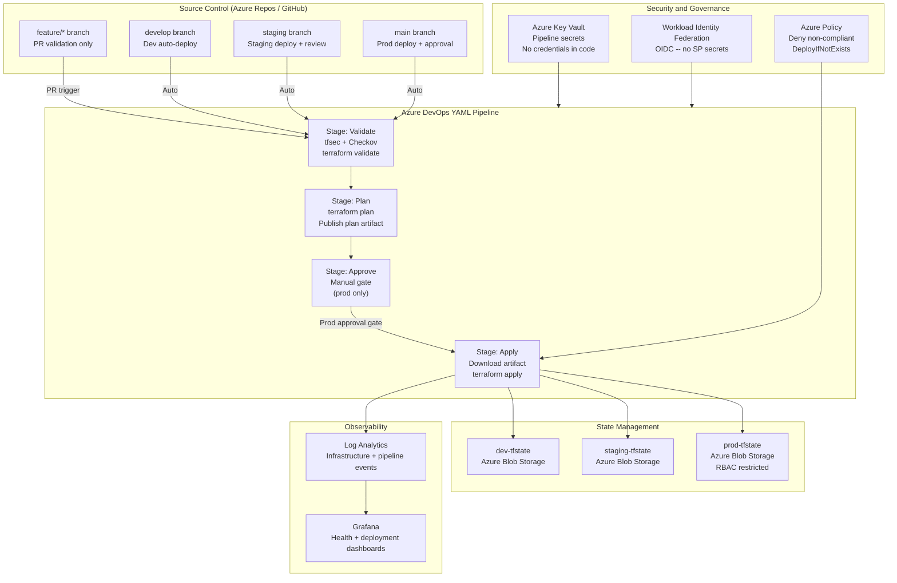

# Infrastructure Automation with Terraform & Azure DevOps

> Design study — an independent architecture exercise for enterprise Azure environments. Not tied to a real production deployment.

This is a GitOps-driven IaC and CI/CD setup built with Terraform and Azure DevOps YAML pipelines. It covers multi-environment deployment governance, an approval gate before anything touches production, Workload Identity Federation instead of stored secrets, Key Vault for pipeline secrets, Azure Policy for compliance, and tfsec/Checkov for security scanning.

---

## Architecture Diagram



---

## Branch Strategy and Deployment Tiers

Each branch maps to one environment, and only `main` needs a human to sign off before anything ships.

| Branch | Deployment Target | Approval | Service Connection | State Backend |
|---|---|---|---|---|
| feature/* | None (PR validation) | N/A | N/A | N/A |
| develop | Development | None (automatic) | dev-service-connection | dev-tfstate |
| staging | Staging | Optional reviewer | staging-service-connection | staging-tfstate |
| main | Production | Mandatory | prod-service-connection | prod-tfstate |

---

## Pipeline Stage Design

| Stage | Actions | Failure Behaviour |
|---|---|---|
| Validate | terraform validate, tfsec, Checkov | Block -- no plan on security findings |
| Plan | terraform init, terraform plan, publish artifact | Block -- no approval/apply |
| Approve | Manual gate (prod only) | Timeout after 24h -- pipeline expires |
| Apply | Download plan artifact, terraform apply | Alert -- rollback runbook invoked |

The plan artifact gets published during the Plan stage and downloaded again in Apply, rather than re-running `terraform plan` right before applying. That's on purpose — if you regenerate the plan at apply time, there's a window where the reviewed plan and the applied plan could quietly diverge. Passing the artifact through guarantees what got reviewed is exactly what gets applied, and closes off drift as a way to sneak changes past approval.

---

## Environment Separation

This uses separate directories per environment rather than Terraform Workspaces:

| Approach | Advantages | Disadvantages |
|---|---|---|
| Terraform Workspaces | Single codebase, simpler structure | Shared backend config, limited isolation, confusion risk |
| Separate directories (this architecture) | Full isolation, independent backends, clear governance | More structure, some duplication |

Every environment gets its own state file, its own backend access controls, its own variable values, and its own service connection. Yes, it means a bit of repeated code across dev/staging/prod — that tradeoff felt worth it for the isolation.

---

## Executive Summary

The goal here was a fully automated IaC and CI/CD platform using Terraform, Azure DevOps YAML pipelines, and GitOps principles — standardizing how infrastructure gets provisioned across dev, staging, and prod, cutting out configuration drift, tightening deployment governance, and ending up with an audit-ready operations model.

---

## Architecture Principles

- Infrastructure as Code is the standard — no clicking around the portal to create resources in governed environments
- GitOps-driven governance — a Git PR review and merge is the change approval mechanism, full stop
- Immutable, repeatable deployments — same code plus same variables should always equal identical infrastructure
- Modular components — each domain is its own independent, testable, versionable module
- Strict environment separation — isolated state, service connections, and variable groups
- Validation happens automatically before deployment — syntax, security, and compliance checks run before anything can apply
- Secure by default — no secrets in code, no hardcoded credentials, no overprivileged connections
- Policy-driven compliance — Azure Policy enforcement runs independently of whatever the Terraform code says
- Centralized observability — infrastructure health and deployment events land in one place

---

## Security Architecture

**Workload Identity Federation (OIDC)**
- Azure DevOps service connections authenticate via OIDC instead of long-lived service principal secrets
- Each pipeline run gets a short-lived federated token
- This removes the credential rotation overhead and the risk of a leaked secret sitting around

**Service connection scoping**
- dev-service-connection: Contributor on the dev resource group only
- staging-service-connection: Contributor on the staging resource group only
- prod-service-connection: Contributor on the prod resource group only, and it's pipeline-only — no human has direct access

**RBAC model**
- Infrastructure engineers: Contributor in dev, Reader in staging and prod
- Senior engineers: Contributor in staging, Reader in prod
- Release approvers: no direct Azure access at all — their job is the pipeline approval, nothing more
- Production: reachable only through the pipeline service connection — no direct human write access, ever

**Azure Policy enforcement**

| Policy | Type | Effect | Purpose |
|---|---|---|---|
| Require TLS 1.2 minimum | Built-in | Deny | Prevent insecure TLS |
| Restrict allowed locations | Custom | Deny | Data residency enforcement |
| Require diagnostic settings | Custom | DeployIfNotExists | All resources forward logs |
| Restrict allowed VM SKUs | Custom | Deny | Prevent non-standard compute |
| Require tags on resources | Built-in | Deny | Cost governance tagging |

---

## Design Decisions

A few of the bigger calls made along the way, and why:

**Terraform over ARM/Bicep**
Went with Terraform for the multi-cloud extensibility, the maturity of its ecosystem (module registry, testing tools), and general team familiarity. Bicep is a perfectly legitimate Azure-only alternative — this isn't a knock on it, just a different tradeoff. The cost is that Terraform's Azure provider sometimes lags behind new Azure API releases, which gets mitigated by pinning provider versions.

**Separate environment directories over Workspaces**
Workspaces share a single backend config, which limits how tightly you can control access per environment. Separate directories give full isolation — independent state files and independent backend RBAC — at the cost of a little code duplication. Worth it for the governance and isolation benefits.

**Plan artifact passing between stages**
Already covered above, but the short version: regenerating the plan right before apply risks applying something different from what got reviewed. Passing the artifact through guarantees apply matches what was reviewed, at the cost of some artifact storage and download overhead.

**Workload Identity Federation over service principal secrets**
Service principal secrets need rotation and create leak risk. WIF hands out short-lived tokens instead — nothing stored, nothing to rotate. There's a one-time setup cost to configure OIDC properly, but it pays for itself pretty quickly.

**tfsec and Checkov in the Validation stage**
Azure Policy will catch problems at deployment time, but a failed deployment wastes pipeline time and can leave partial resource states behind. Running security scans earlier catches issues before that happens. The tradeoff is you need to actively manage false positives — the `.tfsec/config.yml` and Checkov baseline files need upkeep.

**Approval gates via Azure DevOps Environments**
This gives a structured approval workflow — assigned reviewers, a timeout, and a proper audit trail, with every approval decision recorded in pipeline history. It does add deployment latency while waiting on approval, which felt acceptable for prod and optional for staging.

---

## Technologies

| Category | Technologies |
|---|---|
| Infrastructure as Code | Terraform HCL |
| CI/CD and Source Control | Azure DevOps YAML Pipelines · Azure Repos |
| Security Scanning | tfsec · Checkov |
| Cloud Platform | Microsoft Azure |
| State Management | Azure Blob Storage (remote backend + locking) |
| Security and Governance | Azure Key Vault · Azure RBAC · Azure Policy · WIF (OIDC) |
| Monitoring | Azure Monitor · Log Analytics · Grafana |

---

## Repository Structure

```
terraform-azure-devops/
├── environments/
│   ├── dev/
│   │   ├── main.tf
│   │   ├── variables.tf
│   │   ├── backend.tf
│   │   └── terraform.tfvars.example
│   ├── staging/
│   │   ├── main.tf
│   │   ├── variables.tf
│   │   ├── backend.tf
│   │   └── terraform.tfvars.example
│   └── prod/
│       ├── main.tf
│       ├── variables.tf
│       ├── backend.tf
│       └── terraform.tfvars.example
├── modules/
│   ├── network/
│   ├── compute/
│   ├── database/
│   ├── security/
│   ├── monitoring/
│   └── aks/
├── pipelines/
│   ├── azure-pipelines.yml
│   ├── pipeline-dev.yml
│   ├── pipeline-staging.yml
│   └── pipeline-prod.yml
├── policies/
│   ├── require-tls12.json
│   ├── restrict-locations.json
│   └── require-tags.json
├── scripts/
│   ├── bootstrap-state-backend.sh
│   └── unlock-terraform-state.sh
└── docs/
    ├── architecture.md
    ├── pipeline-guide.md
    └── false-positive-management.md
```

---

## Where This Could Go Next

- OPA/Conftest to validate Terraform plans against custom governance rules before apply
- Automated drift detection through scheduled `terraform plan` runs
- Infracost integration so cost estimates show up as PR comments before approval
- Extending this multi-cloud to AWS and GCP through additional Terraform providers
- GitOps integration with AKS via Flux or ArgoCD
